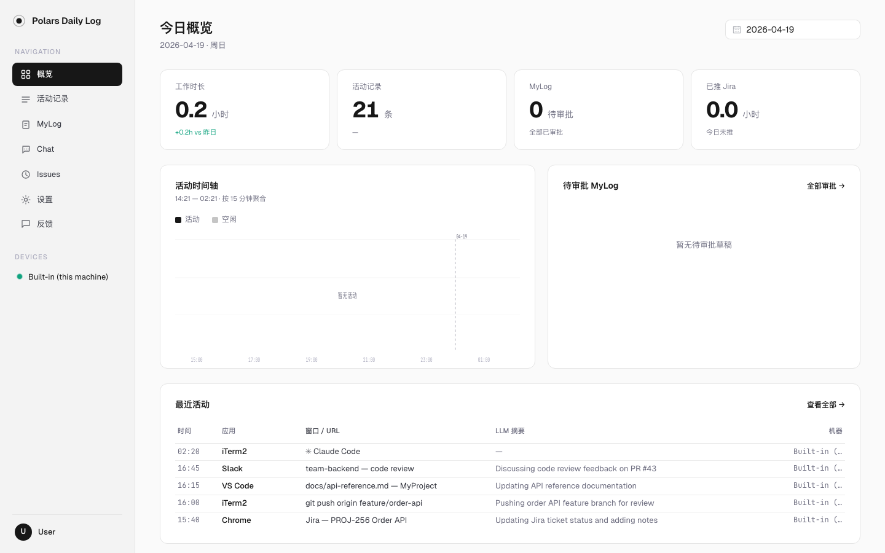

<div align="center">


### 你的每一天，自动从活动记录到工时日志。

一个本地优先的个人工作活动聚合器。默默记录你每台机器的前台活动 + Git commits，交给 LLM 总结成日志，一键推给 Jira / 企业微信 / 飞书 / Slack。

[English](README.md) / 中文

<a href="https://github.com/Conner2077/polars-daily-log/issues">反馈问题</a> · <a href="https://github.com/Conner2077/polars-daily-log/issues/new?labels=feedback">留言</a> · <a href="CHANGELOG.md">更新日志</a> · <a href="docs/release.md">Release 指南</a>

[![Release][release-shield]][release-link]
[![Stars][stars-shield]][stars-link]
[![Issues][issues-shield]][issues-link]
[![License][license-shield]][license-link]
[![Last commit][last-commit-shield]][last-commit-link]  
[![Python][python-shield]][python-link]
[![Platform][platform-shield]][platform-link]
[![Downloads][downloads-shield]][downloads-link]

🔒 **100% 本地** — 一人一套数据，永远不离开你自己的机器。

</div>

## 功能一览



| 页面 | 功能 |
|------|------|
| **概览** | 今日工作时长、活动条数、时间轴、待审批日志 |
| **活动记录** | 浏览所有前台窗口、URL、LLM 摘要、截图 |
| **MyLog** | 查看 / 编辑 / 推送每日、每周、每月、每季度日志 |
| **Chat** | 智能问答 — 问"我这周干了什么"、"帮我整理工时"、导出对话 |
| **Issues** | 管理活跃的 Jira Issue，用于按任务拆分工时 |
| **设置** | LLM 引擎、Git 仓库、Jira、Prompt、总结周期与输出、隐私、自动更新 |

详细功能说明和使用截图见 [使用指南](docs/usage-guide.md)。

---

## 你有几台机器？

| 你的情况 | 装法 |
|---------|------|
| **只在一台电脑上用**（最常见）| 一台上装 "both"——server + collector 一体 |
| **多台电脑想汇总**（MacBook + 工作台式 + Linux 等） | 最常开机的那台装 "both" 当 hub，其他机器只装 "collector" 推过来 |
| **我想改代码** | [跳到 §开发者](#开发者) |

---

## 快速开始

### 前置

| | macOS | Linux | Windows |
|---|-------|-------|---------|
| Python 3.9+ | 自带 | 自带 | `winget install Python.Python.3.12` |
| git | `xcode-select --install` | `apt install git` | `winget install Git.Git` |

### 装

#### 一条命令装（推荐，macOS / Linux）

```bash
curl -fsSL https://raw.githubusercontent.com/Conner2077/polars-daily-log/master/bootstrap.sh | bash
```

会自动：拉最新 release → 解压到 `~/.polars-daily-log` → 跑 `install.sh`。
非交互模式也能：

```bash
curl -fsSL https://raw.githubusercontent.com/Conner2077/polars-daily-log/master/bootstrap.sh | \
  PDL_ROLE=collector \
  PDL_SERVER_URL=http://你的hub机器IP:8888 \
  PDL_COLLECTOR_NAME=my-laptop \
  bash
```

可选 env：`PDL_VERSION`（钉版本，默认 latest）、`PDL_INSTALL_DIR`（默认 `~/.polars-daily-log`）。

#### 手动装（Windows，或想拿到 tarball 离线拷给别人）

1. **下载 tarball**：[Releases 页](https://github.com/Conner2077/polars-daily-log/releases)
2. **解压**

   ```bash
   tar xzf polars-daily-log-0.2.0.tar.gz
   cd polars-daily-log-0.2.0
   ```

3. **跑 installer**

   ```bash
   # macOS / Linux
   bash install.sh

   # Windows (PowerShell)
   powershell -ExecutionPolicy Bypass -File install.ps1
   ```

4. **跟着问答走**

   **场景 A — 只在这一台机器用**：

   ```
   0. What are you installing?
     1) server      — ...
     2) collector   — ...
     3) both        — ...
     Choose: 3          ← 选 both
   ```

   **场景 B — 这是第 N 台机器，只想推数据到你的 hub**：

   ```
     Choose: 2          ← 选 collector
     Server URL: http://你的hub机器的IP:8888
     Collector name [此机hostname]: ←回车用默认
   ```

5. **启动**

   ```bash
   ./pdl server start            # 场景 A 或 hub
   ./pdl collector start         # 场景 B
   ```

6. **打开 `http://127.0.0.1:8888`**（或 hub 机器 IP）看自己的日志。首次进去 Settings 配一下：
   - **LLM**：选 Kimi / OpenAI / Claude，填 API Key（或留空用内置 Kimi）
   - **Jira**（可选）：如果想把日志同步为 Jira 工时，扫码登录 Jira SSO

---

## 日常操作

### 启停

| 场景 | 命令 |
|------|------|
| 启动 | `./pdl start`（server + collector 一起）|
| 只启 server | `./pdl server start` |
| 只启 collector | `./pdl collector start` |
| 看状态 | `./pdl status` |
| 停 | `./pdl stop` |
| 重启 | `./pdl restart` |

### 日志 / 调试

```bash
./pdl server logs 100         # server 后端 log
./pdl server logs -f          # 实时跟
./pdl collector logs 50       # collector log
```

### Windows 上的等价操作

目前 Windows 靠 Scheduled Task 自启（安装时会问你要不要登录时自动起）：

```powershell
Start-ScheduledTask -TaskName AutoDailyLogServer
Stop-ScheduledTask -TaskName AutoDailyLogServer
Get-ScheduledTaskInfo -TaskName AutoDailyLogCollector
```

### 数据 / 日志位置

| 东西 | 路径 |
|------|------|
| 数据库（活动、日志、配置）| `~/.auto_daily_log/data.db` |
| 截图 | `~/.auto_daily_log/screenshots/YYYY-MM-DD/` |
| Server log | `~/.auto_daily_log/logs/server.log` |
| Collector log | `~/.auto_daily_log_collector/logs/collector.log`（独立 collector 时）|
| 配置文件 | `<解压目录>/config.yaml`、`<解压目录>/collector.yaml` |

升级覆盖 tarball 时，这些 `~/` 下的**都不会动**，升级不丢数据。

---

## 核心功能

### 总结周期（Scope）

系统支持四种日历对齐的总结周期，每种可配置独立的触发时间：

| 周期 | 说明 | 默认触发时间 |
|------|------|-------------|
| 日报 (day) | 按自然天总结 | 22:33 |
| 周报 (week) | 按自然周总结（周一到周日）| 周日 |
| 月报 (month) | 按自然月总结 | 月末 |
| 季报 (quarter) | 按自然季度总结 | 季末 |

在 **Settings > 总结周期** 中管理。每个周期可挂多个输出（Output），每个输出有自己的 LLM 引擎、Prompt 模板、推送平台配置。

### 多引擎 LLM

支持同时配置多个 LLM 引擎（Kimi / OpenAI / Claude / 自定义 endpoint），不同的输出可以使用不同的引擎。在 **Settings > LLM 引擎** 中管理。

### Git 仓库采集

在 **Settings > Git 仓库** 中添加本地 git 仓库路径和 author email，系统会在生成日志时自动采集当天的 commit 记录（message、改动行数、文件列表），和前台活动一起喂给 LLM 生成更准确的日报。

### 推送到群聊（Webhook）

除了 Jira，还可以通过 webhook 把日志推送到企业微信、飞书、Slack 群聊或任意 HTTP 端点。

1. 在群聊中**创建机器人**，复制 Webhook URL
2. 打开 **Settings > 总结周期** > 添加或编辑输出
3. 推送平台选 **Webhook**，粘贴 URL，选择**消息格式**（企业微信 / 飞书 / Slack / 通用 JSON）
4. 推送方式选"手动推送"或"定时生成后自动推送"

| 格式 | 发送的 body |
|------|------------|
| 企业微信 | `{"msgtype":"markdown","markdown":{"content":"..."}}` |
| 飞书 | `{"msg_type":"text","content":{"text":"..."}}` |
| Slack | `{"text":"..."}` |
| 通用 JSON | `{"issue_key":"...","time_spent_sec":...,"comment":"...","started":"..."}` |

> **手动 vs 自动**："定时生成后自动推送"仅在 scheduler 按 cron 定时生成日志时触发。在 UI 中手动点"生成"**不会**自动推送——需要在生成的 summary 上手动点推送按钮。

### Chat — 智能问答

基于最近 7 天的工作日志和活动记录的 AI 对话。可以：
- 问"我这周做了什么"
- 让它"帮我整理为工时草稿"
- 导出对话历史

### 隐私保护

- 所有数据 100% 存储在本地，不上传任何服务器
- `config.yaml` 中可配置 `blocked_apps` / `blocked_urls` 屏蔽特定应用或网站
- 企业微信等敏感应用在 `hostile_apps_applescript` 配置中跳过深度采集
- 删除的数据进回收站，可在 **Settings > 回收站** 中彻底清理

### 反馈

左侧导航栏点**"反馈"** — 选类型（Bug / 建议 / 其他），写几句提交即可。后台自动附当前页面 URL 和浏览器 UA。

---

## 升级

**用 bootstrap 装的**：再跑一遍同一条 curl 命令，原地覆盖升级（会先 `./pdl stop`，数据保留）。

**手动装的**：
```bash
# 停服务
./pdl stop

# 解压新 tarball 覆盖当前目录（venv 保留，数据在 ~/ 下也在）
tar xzf polars-daily-log-0.2.0.tar.gz --strip-components=1

# 从新 wheel 重装 Python 部分，前端 dist 也在 wheel 里
./pdl build --restart
```

也可以在 **Settings > 自动更新** 中开启自动检测和更新。

如果 release notes 说有 config 迁移，会在 `CHANGELOG.md` 顶部明确写出来。

---

## 卸载

```bash
./pdl stop
cd ..
rm -rf ~/.polars-daily-log            # 代码 + venv + 配置
rm -rf ~/.auto_daily_log              # 数据 + 日志（不想删日志就跳过）
rm -rf ~/.auto_daily_log_collector    # 独立 collector 的凭据 + 离线队列
```

Windows 额外：
```powershell
Unregister-ScheduledTask -TaskName AutoDailyLogServer -Confirm:$false
Unregister-ScheduledTask -TaskName AutoDailyLogCollector -Confirm:$false
```

---

## 故障排查

| 症状 | 怎么看 |
|------|--------|
| `No module named aiosqlite` 启动就崩 | venv 没激活 / 跳过了 `install.sh`。重跑 `bash install.sh` |
| 当日总结只有 "Activity summary: ..." 行 | LLM 调用失败 → Web UI Settings 检查 engine / URL / API Key 对得上 |
| 提交 Jira 返 500 "内部服务器错误" | comment 含 emoji。新版已自动去除，升级一下 |
| 企业微信 2-4 分钟自退 | 确认 `config.yaml` 里 `monitor.hostile_apps_applescript` 包含 `企业微信/wechat/wecom` |
| Webhook 推送显示成功但群里没收到 | 检查 publisher_config 里的 `format` 是否和平台匹配（企微用 `wecom`、飞书用 `feishu`） |
| 前端白屏 | `./pdl server logs 50` 看后端；硬刷浏览器 Cmd+Shift+R |
| Windows collector 不动 | 看 `%USERPROFILE%\.auto_daily_log_collector\logs\collector.log`；检查 Scheduled Task 状态 |

---

## 开发者

如果你拿到的是 git 仓库而不是 tarball，想改代码：

### 前置
- Python 3.9+、Node.js 18+、git

### 起步

```bash
git clone https://github.com/Conner2077/polars-daily-log.git
cd polars-daily-log
bash install.sh              # 自动识别无 wheel → dev 模式（pip install -e . + 前端源码构建）
./pdl server start
```

### 日常

| 场景 | 命令 |
|------|------|
| pull 后重新 build | `./pdl build --restart` |
| 只重建前端 | `./pdl build --no-python` |
| 跑测试 | `.venv/bin/python -m pytest tests/ -q` |
| 前端热更新开发 | `cd web/frontend && npm run dev` 打开 `localhost:5173` |

### 打 release

见 [`docs/release.md`](docs/release.md)。

### 项目原则

见 [AGENTS.md](AGENTS.md)（Claude Code 通过 `CLAUDE.md → @AGENTS.md` 加载）。核心几条：

- **原汁原味**：每日总结不筛选，下游（Jira 提交用 `AUTO_APPROVE_PROMPT`）二次加工
- **两层平台代码**：raw OS API 在 `auto_daily_log/monitor/`，adapter 在 `auto_daily_log_collector/platforms/`
- **Jira 提交唯一入口**：`jira_client.client.build_jira_client_from_db`，自带 emoji / 4-byte UTF-8 scrub

---

## 许可证

Apache 2.0。详见 [LICENSE](LICENSE)。

<!-- Badge references -->
[release-shield]: https://img.shields.io/github/v/release/Conner2077/polars-daily-log?style=flat-square&color=brightgreen&label=release
[release-link]: https://github.com/Conner2077/polars-daily-log/releases
[stars-shield]: https://img.shields.io/github/stars/Conner2077/polars-daily-log?style=flat-square&color=yellow
[stars-link]: https://github.com/Conner2077/polars-daily-log/stargazers
[issues-shield]: https://img.shields.io/github/issues/Conner2077/polars-daily-log?style=flat-square&color=orange
[issues-link]: https://github.com/Conner2077/polars-daily-log/issues
[license-shield]: https://img.shields.io/github/license/Conner2077/polars-daily-log?style=flat-square&color=blue
[license-link]: https://github.com/Conner2077/polars-daily-log/blob/master/LICENSE
[last-commit-shield]: https://img.shields.io/github/last-commit/Conner2077/polars-daily-log?style=flat-square
[last-commit-link]: https://github.com/Conner2077/polars-daily-log/commits/master
[python-shield]: https://img.shields.io/badge/python-3.9%2B-blue?style=flat-square&logo=python&logoColor=white
[python-link]: https://www.python.org/downloads/
[platform-shield]: https://img.shields.io/badge/platform-macOS%20%7C%20Linux%20%7C%20Windows-lightgrey?style=flat-square
[platform-link]: #前置
[downloads-shield]: https://img.shields.io/github/downloads/Conner2077/polars-daily-log/total?style=flat-square&color=success
[downloads-link]: https://github.com/Conner2077/polars-daily-log/releases
