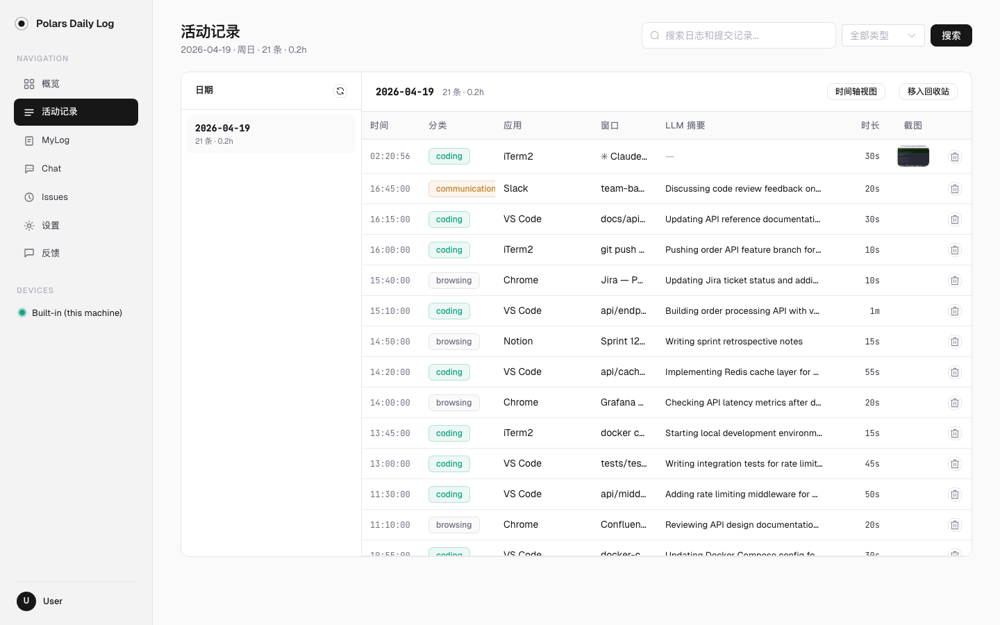
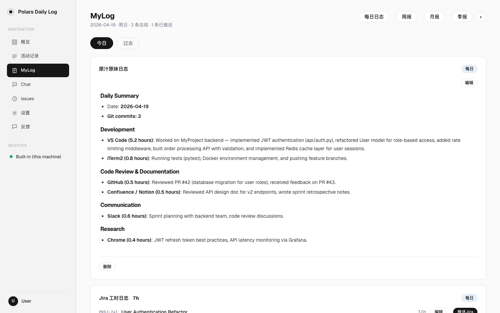
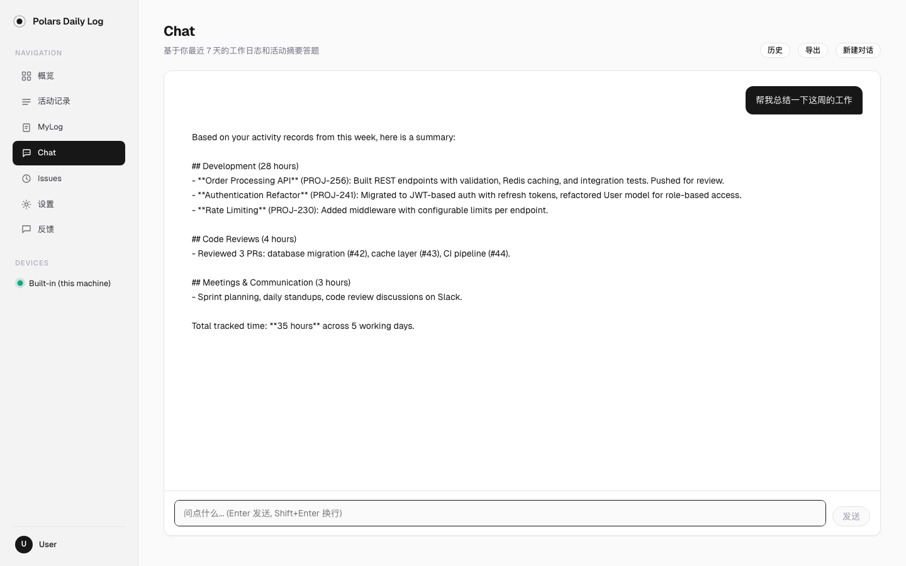
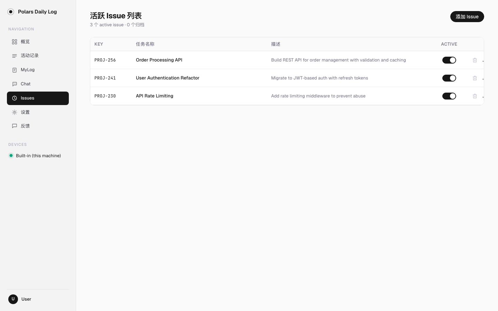
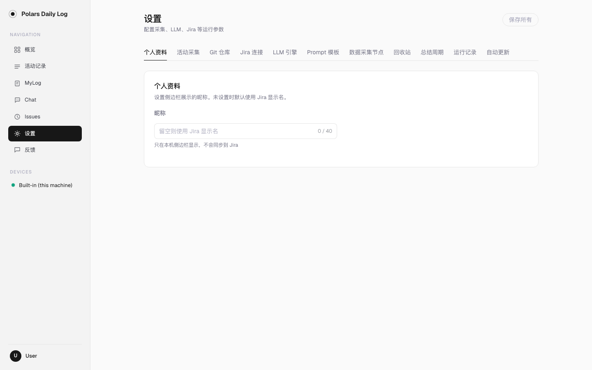

# 使用指南

本文档介绍 Polars Daily Log 各页面的功能和操作方式。

---

## 概览（Dashboard）

打开首页即可看到今日概览：工作时长、活动条数、待审批日志、已推送工时，以及活动时间轴和最近活动列表。

- **工作时长**：根据活动记录自动计算，显示与昨日的对比
- **活动记录**：当天采集到的前台活动总条数
- **MyLog**：当天生成的日志中待审批的条数
- **已推 Jira**：当天推送到 Jira 的工时小时数
- **活动时间轴**：以 15 分钟为单位聚合，黑色为活动、灰色为空闲
- **待审批 MyLog**：展示需要处理的日志卡片，可直接审批
- **最近活动**：最近的前台活动列表，显示应用、窗口、LLM 摘要

右上角日期选择器可切换查看历史日期。

---

## 活动记录（Activities）

浏览所有采集到的前台窗口活动，按日期分组。

- 左侧日期列表显示每天的活动条数和工作时长
- 点击日期切换查看
- 每条记录包含：时间、分类标签（coding/browsing/communication 等）、应用名、窗口标题、LLM 摘要、时长、截图缩略图
- 右上角可按关键词搜索、按分类筛选
- **时间轴视图**：点击"时间轴视图"按钮切换为可视化时间线
- **移入回收站**：批量软删除不需要的记录

多设备时，顶部会出现设备筛选器（全部 / Built-in / 其他设备名）。

---

## MyLog — 日志管理

查看和管理由 LLM 生成的日志，按日期和输出类型分组。

- 顶部 tab 切换日志类型：每日日志、周报、月报、季报
- **今日 / 过去**：切换查看今天或历史日志
- 每份日志显示 scope 标签（每日）和输出名称（如"原汁原味日志"、"Jira 工时日志"）
- **编辑**：修改日志内容后保存
- **推送 Jira / 推送 Webhook**：将日志推送到配置的平台
- **删除**：软删除日志（进回收站）

对于 per_issue 模式的输出（如 Jira 工时日志），会按 Issue 拆分显示，每条显示 issue key、工时小时数。

---

## Chat — 智能问答

基于最近 7 天的工作日志和活动记录的 AI 对话。

- 输入框输入问题，Enter 发送，Shift+Enter 换行
- 可以问工作相关的问题，如"我这周做了什么"、"帮我整理为工时草稿"
- **历史**：查看历史对话列表
- **导出**：导出当前对话为文本
- **新建对话**：开始新的会话

Chat 会自动加载最近的日志和活动记录作为上下文，无需手动粘贴。

---

## Issues — 任务管理

管理活跃的 Jira Issue，用于 per_issue 模式（按任务拆分工时日志）。

- **添加 Issue**：输入 Jira Issue Key（如 PROJ-256）和任务名称
- **Active 开关**：控制该 Issue 是否参与 per_issue 日志生成
- **删除**：移除不再需要的 Issue

只有 Active 状态的 Issue 会在生成 per_issue 日志时被使用。

---

## 设置（Settings）

所有配置集中在设置页面，分为多个 tab：

### 个人资料
设置侧边栏显示的昵称。

### 活动采集
配置采集间隔、隐私屏蔽规则（blocked_apps / blocked_urls）。

### Git 仓库
添加本地 git 仓库路径和 author email。生成日志时会自动采集当天的 commit 记录（message、改动行数、文件列表），和前台活动一起喂给 LLM。

### Jira 连接
配置 Jira Server URL，扫码登录 SSO。登录后可推送工时日志。

### LLM 引擎
管理多个 LLM 引擎（Kimi / OpenAI / Claude / 自定义 endpoint）。不同的输出可以使用不同的引擎。

### Prompt 模板
查看和编辑日志生成使用的 Prompt 模板。

### 数据采集节点
查看已连接的 Collector 节点及其状态。

### 总结周期
管理总结周期（日报 / 周报 / 月报 / 季报）和每个周期下的输出配置：

| 配置项 | 说明 |
|--------|------|
| 输出名称 | 如"原汁原味日志"、"企业微信群推送" |
| 输出模式 | single（整篇总结）或 per_issue（按 Issue 拆分） |
| LLM 引擎 | 可为每个输出指定不同引擎 |
| 推送平台 | Jira / Webhook（企微、飞书、Slack、通用 JSON）/ 无 |
| 消息格式 | 企微用 markdown 格式，飞书/Slack 用 text 格式 |
| 推送方式 | 手动推送 / 定时生成后自动推送 |
| Prompt 模板 | 默认模板或自定义 |

### 回收站
查看和恢复被删除的活动记录，或彻底清理。

### 运行记录
查看 scheduler 的运行历史和状态。

### 自动更新
检测新版本并自动更新。

---

## 推送到群聊（Webhook）

除了 Jira，还可以通过 webhook 把日志推送到企业微信、飞书、Slack 群聊或任意 HTTP 端点。

### 配置步骤

1. 在群聊中**创建机器人**，复制 Webhook URL
2. 打开 **设置 > 总结周期** > 添加或编辑输出
3. 推送平台选 **Webhook**，粘贴 URL，选择**消息格式**
4. 推送方式选"手动推送"或"定时生成后自动推送"

### 消息格式

| 格式 | 发送的 body |
|------|------------|
| 企业微信 | `{"msgtype":"markdown","markdown":{"content":"..."}}` |
| 飞书 | `{"msg_type":"text","content":{"text":"..."}}` |
| Slack | `{"text":"..."}` |
| 通用 JSON | `{"issue_key":"...","time_spent_sec":...,"comment":"...","started":"..."}` |

### 手动 vs 自动推送

- **手动推送**：在 MyLog 页面生成日志后，手动点推送按钮
- **定时生成后自动推送**：仅在 scheduler 按 cron 定时生成日志时自动推送。手动点"生成"**不会**触发自动推送

---

## 隐私保护

- 所有数据 100% 存储在本地，不上传任何服务器
- `config.yaml` 中可配置 `blocked_apps` / `blocked_urls` 屏蔽特定应用或网站
- 企业微信等敏感应用在 `hostile_apps_applescript` 配置中跳过深度采集
- 删除的数据进回收站，可在 **设置 > 回收站** 中彻底清理
